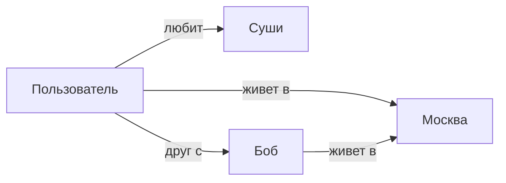
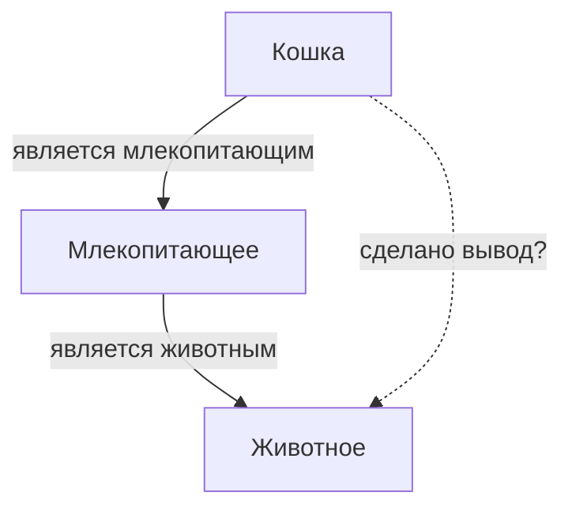
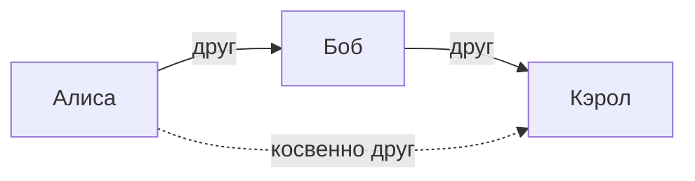

# Ресёрч 12. Определения агентской и контекстной памяти (25.08)

> Внешний обзор, лежал в загрузках с 25.08, положен в проект 09.09.2026.
>
> **Ранее его сознательно не брали.** Ресёрч 10 (соседний файл того же дня)
> отметил: «путь без обучения и без эмбеддингов уже выбран, обзор к нему ничего
> не добавляет» — там ILP, GNN и онтологии, то есть ровно то, от чего мы ушли.
> Решение по содержанию остаётся в силе; файл кладём для полноты корпуса, чтобы
> исследования не жили на одной машине в загрузках.
>
> Что в нём есть сверх ресёрча 10: разграничение агентской и контекстной памяти
> как понятий, обзор способов выделять значимое, примеры графовых представлений
> контекста и вывод по косвенным данным.
>
> Оригинал без правок ниже.

---

# Краткое резюме  
Агентская память — это способность ИИ-системы накапливать, структурировать и извлекать информацию о прошлых взаимодействиях. Контекстная память (практически совпадающая с понятием *рабочей памяти* или *in-context memory*) хранит текущее состояние диалога и задачи. Главная разница в том, что контекстная память временная и привязана к текущей сессии, тогда как агентская память долговременная, персональная и эволюционирует с опытом агента. В этом отчёте проанализированы формальные определения этих концепций, методы выделения значимого контента в памяти агента, примеры графовых представлений контекста, алгоритмы вывода по косвенным данным, а также инструменты и практические примеры.  

## 1. Определения «агентской» и «контекстной» памяти  
**Агентская память** (agent-based memory) – весь набор механизмов хранения знаний у ИИ-агента, включая долговременную (эпизодическую, декларативную) и краткосрочную память. Она обеспечивает накопление опыта (преференций, фактов, результатов действий), который агент извлекает для принятия решений. В работах Generative Agents это описывается как «способность системы хранить, организовывать и извлекать информацию из прошлых взаимодействий». Агентская память читает и записывает: она персональна (подстроена под конкретного пользователя/агента) и меняется со временем. В отличие от подходов RAG (read-only KB), агентская память обучается на собственном опыте, растёт и уточняется с каждой сессией. 

**Контекстная память** (context memory) в данном отчёте близка к понятию рабочей памяти агента — то, что агент «видит» в текущий момент: текущий диалог, задачу и близкую историю взаимодействия. Она реализуется, например, как окно контекста LLM (внутри модели) или как ограниченный буфер извлечённых фактов. Контекстная память более эфемерна и ограничена размером буфера, тогда как агентская память может храниться во внешней базе и неявно влиять на ответ модели. Таким образом, **контекстная память** – активный контекст, а **агентская память** – персональное долговременное знание. Они пересекаются: агент извлекает из долговременной (агентской) памяти факты, чтобы поддержать текущее состояние (контекстную память). 

## 2. Критерии отбора значимой информации в памяти агента  
Ключевая проблема — не зафиксировать всю информацию, а выделить важную и отфильтровать шум. На первом этапе извлечения из входного потока агентская память применяет эвристику релевантности: оставляет только факты и предпочтения, которые «вероятно понадобятся в будущем», и отбрасывает помехи. Например, в Generative Agents вводят *оценку важности* (salience score) для каждого наблюдения и объединяют её с затуханием «старшинства» (recency), чтобы ранжировать и выбирать, что хранить. Известно, что богатый контекст (e.g. ChatGPT) сохраняет личные предпочтения пользователя, но часто не умеет автоматически забывать нерелевантные детали. 

Формальные признаки значимости могут включать: **частоту** упоминания (например, TF–IDF, повторение события подчёркивает его важность), **редкость** (новизна или неожиданность события повышает его приоритет), **вес центральности** в графе знаний (узел с большим числом связей или высоким PageRank важен контекстно) и **внимание LLM** (ключевые токены с высоким attention). A‑Mem извлекает из каждого сообщения «ключевые слова, темы и теги», опираясь на семантическую близость: система получает эмбеддинг нового факта и ищет ближайшие по эмбеддингу узлы памяти. Это сочетает в себе эвристику «семантической релевантности» (embedding similarity) и дедукцию LLM при связывании данных. 

Примером формального подхода является Generative Agents: они присваивают каждому событию оценку значимости и используют её при извлечении. Методы анализа связности графа (например, подсчёт общих соседей, коэффициенты Жаккара, центральность Катца) дают дополнительные метрики «важности» узлов при проверке связей. В целом, совокупность эвристик может включать: влияние **внимания** (LLM-сфокусированность на токенах), **частотные модели** (повторность событий), **графовые метрики** (степень, PageRank) и **семантическое сходство эмбеддингов**.

## 3. Примеры графов контекстной памяти  
Контекстная память часто представляют в виде графов знаний: онтологий, семантических сетей или RDF-триплетов. В таких графах узлы – это сущности или концепты, а ребра – семантические отношения. Например, RDF-граф содержит тройки вида (субъект, предикат, объект) – «Пользователь (субъект) – живёт в – Москва (объект)». Набор стандартных форматов – RDF, Property Graph (Neo4j, JanusGraph), OWL/Ontology и др. На рис.1 приведён упрощённый пример семантической сети:  
 *Рис.1. Пример семантической сети (узлы – понятия, рёбра – отношения). Такую графовую модель часто используют для формализации контекста.*  

В графах память может быть структурирована дополнительно: есть **схемы** узлов/свойств (например, RDF-схема или OWL-онтология), благодаря которым определяется тип отношения. Форматы данных – XML/RDF, Turtle, JSON-LD, Property Graph с метками ребёр и узлов и т.д. Например, для знания о книгах тройки могут быть (Книга, автор, Автор), (Автор, родился, Год). Ниже – иллюстрация простого графа контекста (сгенерированная):  

Такой формат позволяет наглядно представить факты, в т.ч. вложенные. На рис.2 показана структура BabelNet – крупного многоязычного графа-сети понятий (словообразований и взаимосвязей):  
 *Рис.2. Фрагмент графа BabelNet (семантическая сеть знаний). Узлы – «семантические концепты», рёбра – отношения между ними.*  

Другой пример – классическая семантическая сеть (рис.3), где значимые концепты (напр. «млекопитающее», «кошка») связаны логическими отношениями (является, часть). В качестве контекстной памяти она хранит иерархию и свойства объектов:  
 *Рис.3. Ещё один пример семантической сети (упрощённая схема понятий и их связей).*  

Такие графы удобно визуализировать и сохранять: форматы – RDF-триплеты, property graphs или OWL-файлы. Для визуализации применяют как текстовые схемы (mermaid, Graphviz), так и GUI-библиотеки (Gephi, Neo4j Bloom). Они упрощают понимание, например, объединяя схожие отношения в модули или акцентируя центральные узлы.  

## 4. Методы вывода по косвенным признакам  
**Индуктивное заключение (ILP, FOIL, Progol, Aleph)** – из множества фактов строятся общие правила (условия), позволяющие вывести новые факты. Такие системы изучают примеры (фактов) и генерируют логические правила (например, Datalog), реализуя «от фактов к общему» (bottom-up). ILP применяется для открытия отношений в базах фактов, но требует явно заданной логической модели.  

**Методы распространения меток (Label Propagation)** – предполагают семисупервизорную классификацию узлов: если известно, что некоторым узлам присвоен признак, алгоритм распростра­няет этот признак по графу на соседей, опираясь на структуру связей. Например, NetworkX имеет реализацию Label Propagation Algorithm для обнаружения сообществ или распространения доверительных меток.  

**Вероятностные графические модели (MLN, Markov сети, SPN)** – объединяют статистику и логику: каждая потенциальная логическая формула связывается с весом, строится граф вероятностей (факторная сеть). Вывод новой информации осуществляется методом вычисления максимального правдоподобия или MAP-инференса по этой сети. Например, **Markov Logic Networks (MLN)** комбинируют первой-­порядковой логики правила с вероятностными весами, позволяя учесть неопределённость.  

**Графовые нейросети (GNN)** – современные методы, обучаемые на графовых данных. Они автоматически извлекают высокоуровневые признаки узлов и ребер и могут предсказывать пропущенные связи (link prediction), метки узлов или классификацию. Модели GCN, GAT, R-GCN и др. успешно применяются для «дедукции» в знаниях: например, фреймворк SEAL учит GNN распознавать шаблоны существующих связей и превосходит классические эвристики (общие соседи, PageRank и т.д.). В частности, библиотека PyTorch Geometric предоставляет готовые механизмы для обучения GNN над графами.  

**Логический вывод (OWL/Datalog/SWRL)** – применение правил дедуктивной логики и онтологического вывода. Например, RDF-разработка использует встроенные механизмы OWL-Reasoner (программная система Protege, Apache Jena) для вывода всех следствий по существующим фактам и правилам. Переходы вида «если A – родитель B и B – родитель C, то A – предок C» (транзитивность) реализуются через правила описания онтологии.  

Ниже суммируем эти подходы:  

| Метод               | Описание                                    | Инструменты/Пример                                |
|---------------------|---------------------------------------------|---------------------------------------------------|
| Индуктивные правила | ILP: поиск логических закономерностей по примерам | Aleph, Prolog, Datalog, ProbLog                   |
| Распространение меток | Semi-supervised: метки узлов растекаются по графу | NetworkX LPA, GraphLab, LabelSpreading           |
| Вероятностные ГМ     | MLN, Байесовские сети: вывод новых фактов через вероятности | Markov Logic (Alchemy), Bayesian Network (PGMpy) |
| Графовые нейросети   | GNN для предсказания ребёр и узлов на основе структуры | PyTorch Geometric, DGL, GraphSAGE    |
| Логический вывод    | OWL/Datalog: дедуктивный вывод по онтологиям и правилам | RDF-онтологии (OWL2), SPARQL, Protege, Jena      |

Каждый из этих подходов сочетает разные сильные стороны: например, GNN автоматически улавливают сложные графовые паттерны, а логические движки гарантируют формальную корректность вывода (но могут терять гибкость в больших онтологиях). Оценка достоверности при выводе обычно строится на вероятности (в MLN — вес формулы) или рейтинге линков (в GNN — вероятность связи). В любом случае важно проверять качество: например, метрики link prediction (MRR, Hits@K) и точность/полноту выводимых фактов.

## 5. Иллюстративные примеры вывода фактов  
Рассмотрим несколько наглядных сценариев работы косвенного вывода на графах.  

**Пример 1: транзитивный вывод (часть–целое).**  
Если известно, что *«Кошка — часть Млекопитающих»* и *«Млекопитающее — часть Животных»*, то мы можем вывести *«Кошка — часть Животных»*. На уровне графа: вершина «Кошка» через отношения part-of связана с «Млекопитающие», а «Млекопитающие» – с «Животные». Достаточно правила транзитивности, чтобы вывести новую связь. Вот схематичный пример:  

Знак «-.->» иллюстрирует выводимую связь: логический механизм (например, онтология или система правил) добавит ребро (Кошка → Животное) после анализа двух исходных.  

**Пример 2: друг друга подруги (двухшаговая связь).**  
Пусть есть «Алиса — друг Боба» и «Боб — друг Кэрол». Хотя напрямую «Алиса — друг Кэрол» не было указано, можно предположить (графовая нейросеть или правило «друг друга подруги») связь «Алиса — друг Кэрол». Графическое представление:  

На примере реального кейса: если агент знает о двух людях, общающихся через посредника, он может по косвенным признакам вывести о них новый факт.  

**Пример 3: причинно-следственный вывод.**  
Предположим, в графе: «Проблема X — вызывает — Симптом Y» и «Симптом Y — показатель болезни Z». Агент может вывести, что «Проблема X — связана с болезнью Z» по косвенной цепочке. Такой вывод часто используется в медицинских графах знаний.  

На этих примерах видно, как по нескольким «косвенным» связям в графе выводится новый факт. Для визуализации можно строить диаграммы графа (как выше) или фактические графы из реальных данных.  

## 6. Инструменты и реализации  
Для реализации графовой памяти и методов вывода используют разные библиотеки и движки. Ниже — сравнение ключевых:  

| Инструмент            | Назначение                                          | Примечание                                     |
|-----------------------|-----------------------------------------------------|------------------------------------------------|
| **NetworkX** | Анализ и манипуляция графами в Python             | Стандартная библиотека для работы с графами; простота и богатые алгоритмы (центральность, поиск путей и т.п.). |
| **Neo4j**             | Графовая СУБД для хранения семантических графов     | Хранение больших графов с метками ребер; поддерживает Cypher; имеет инструменты GDS (включая link prediction) и интеграцию с PyG. |
| **RDFLib**  | Парсинг и обработка RDF/XML, Turtle и др.          | Позволяет хранить, сериализовать и запрашивать RDF-графы; поддержка SPARQL-выражений. |
| **PyTorch Geometric** | GNN-модели на PyTorch                         | Фреймворк для обучения GNN (GCN, GAT и др.) на графовых данных; для link prediction и кластеризации. |
| **DGL (Deep Graph Lib)** | Альтернативный фреймворк для GNN                 | Похож на PyG, ориентирован на производительность. |
| **OWL-сервисы**       | Онтологические reasoner’ы (Protege, Jena)           | Для дедуктивного вывода по RDF/OWL: позволяют выполнять логику вывода и SPARQL запросы. |
| **LangChain, LlamaIndex** | Обёртки/фреймворки для агентской памяти           | Интеграция LLM с базами памяти (включают инструменты как FAISS, Vector DB, поддерживают вложения/поисковые индексы). |
| **GraphQL**           | Запросы к графовым БД                               | Менее распространённо для AI, но иногда используется для гибкого доступа к графам. |

Также важны **метрики качества**: например, для тестирования вывода на графах используют accuracy/precision/recall фактов, а для link prediction — MRR (mean reciprocal rank) и Hits@K. Если память реализована как retrieval-enhanced, проверяют скорость и полноту возвращаемых фактов.  

Итого, при построении контекстной памяти рекомендуются RDF- или property graph–форматы (например, сохранить контекст агента в Neo4j/JanusGraph или в .ttl-файлах), а выбор инструментов зависит от требуемой гибкости. PyTorch Geometric или DGL пригодятся для обучения собственных GNN, NetworkX — для анализа и прототипирования небольших графов, RDFLib — для обработки семантических тройковых хранилищ.  

## Источники  
В анализе использованы современные академические работы и техническая документация. Основные цитаты: определение памяти агента, подходы Generative Agents к оценке важности, методы A‑Mem для связи заметок, свойства графовых моделей и GNN, а также обзор NetworkX и RDFLib. Источники приведены по ходу изложения.